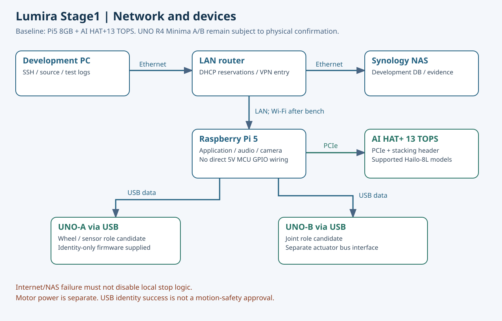

# Lumira Stage1 — 프로그램·운영·실기 연결

[운영 설명서와 연결 이미지](docs/OPERATIONS_KO.md) · [실제 모터 연결 상세](docs/MOTOR_CONNECTION_KO.md) · [자동시험](https://github.com/Lumira077/Lumira-Stage1/actions)

빠른 검증: `python3 scripts/verify_all.py`. 현재 로컬595개 시험 통과, 실제 모터 펌웨어/실기 시험은 미완료입니다.

---

# KER-Robot
KER Robot Development Site

## 2026-10-06 Epic01~17 점검

[개발 점검 보고서](Development/review_20261006/README.md) · [Epic17 설계](Epic-17/README.md) · [Stage1 계약/결과](Development/Stage1/README.md) · [Pi5/UNO 결선 초안](Epic-16/board_design/Lumira_Pi5_UNO_Wiring_R1.md). 이번 보고서는 로컬 시험과 실기 미검증을 구분합니다.

## Lumira077 이관 준비 R2

[프로그램 통합·재검증 보고서](Development/review_20261006_R2/README.md) · [Pi5–UNO 연결 진단](Development/Stage1/bringup/README.md). 대상 저장소는 Lumira077/Lumira-Stage1이며, 2026-10-06 읽기·쓰기 권한과 빈 저장소를 확인했습니다.
