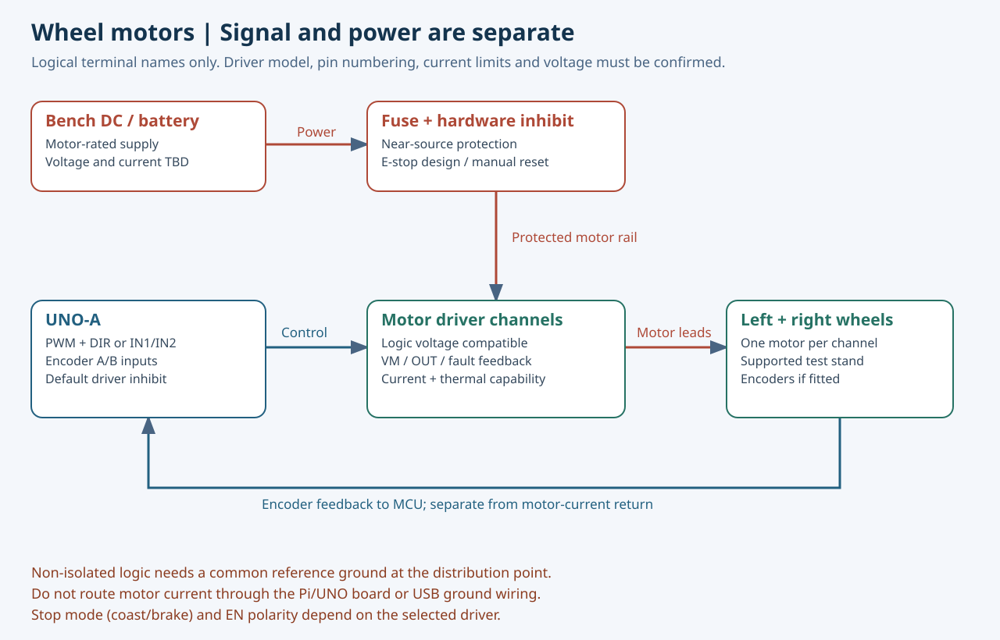
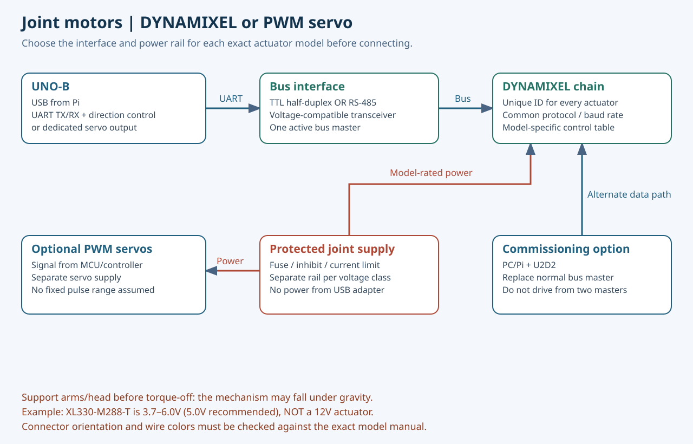

# 실제 모터 제어 연결·시운전 안내

2026-10-06 | Stage1 설계·시운전 절차 초안

**Pi5 → USB → UNO → 전용 드라이버/버스 → 모터**로 제어하고, 모터 전력은 별도 보호 분기로 공급합니다. 현재 제공된 probe 펌웨어는 장치 식별만 수행합니다. 아래 문서는 실제 제어 펌웨어를 완성하기 위한 결선·설정·시험 절차이며, 현 코드로 바로 모터를 움직이는 사용법이 아닙니다.

## 1. 결선 전에 확정할 자료

| 장치 | 필요한 자료 | 결정 사항 |
|---|---|---|
| UNO | R4 Minima 여부·실물 핀아웃 | USB/UART/PWM/인터럽트 핀 배정 |
| 휠 모터 | 정확한 모델·정격 전압·스톨 전류·엔코더 | 드라이버·퓨즈·배선·속도 환산 |
| 모터 드라이버 | 제어 입력 방식·논리 전압·전류/열 정격 | EN 논리·제동/관성정지·fault 입력 |
| 관절 모터 | 모델·TTL/RS-485/PWM·토크·속도·전원 | 버스·전압 분리·관절별 제한 |
| 배터리/BMS | 셀 구성·최대 충전전압·연속/피크 전류 | DC/DC·퓨즈·차단·충전 중 정지 |
| 팔/목 구조 | 길이·질량·무게중심·가동범위 | 지지 장치·정지 자세·토크/가감속 |

아래 PWM_L/EN_L 등의 이름은 **논리 신호명**이다. 임의의 D핀 번호로 배선하지 않는다. 최종 핀 번호는 선택한 드라이버와 UNO 타이머/UART/인터럽트·다른 센서 사용 핀을 대조해 작성한다.

## 2. 휠 DC 모터

| 출발 | 도착 | 연결 조건 |
|---|---|---|
| UNO-A PWM_L / PWM_R | 좌·우 드라이버 PWM 입력 | 입력 허용전압·PWM 주파수·극성 확인 |
| UNO-A DIR_L / DIR_R | 드라이버 DIR 입력 | DIR/PWM 방식일 때만 사용 |
| UNO-A IN1/IN2 | 드라이버 IN1/IN2 | 해당 방식이면 DIR 방식 대신 적용; 혼용 금지 |
| MCU 구동허가 + 하드웨어 차단 | 드라이버 EN/STBY 등 | active-high/low 확인, 리셋·단선 기본값은 구동 금지 |
| 보호된 모터 전원 +/− | 드라이버 VM/GND | 전압·극성·기동전류·차단 정격 확인 |
| 드라이버 OUT1/OUT2 | 모터 두 전력선 | 한 채널당 한 모터; 병렬 연결 가정 금지 |
| 엔코더 A/B | UNO 입력 | 엔코더 전원·출력 레벨·풀업·최대 펄스율 확인 |
| 드라이버 fault/current | UNO 입력/ADC | 레벨·스케일·과전압 보호 확인 |

모터 전류가 UNO 5V/GND 헤더나 USB 배선으로 흐르지 않게 전력 귀환을 분배점에 직접 연결한다. 비절연 신호는 공통 기준 GND가 필요하다. 절연 인터페이스를 사용하면 그 제조사 회로에 맞춘다. 모터선과 센서/USB선은 분리 배선하고, 커넥터 인장 방지와 이동부 여유를 확보한다.

### 휠 시운전 순서

1. 바퀴가 바닥에 닿지 않는 지그에 고정한다. 초기에는 배터리 대신 전류 제한 가능한 DC 전원을 사용한다.
2. 모터 전원을 끈 상태에서 극성·단락·퓨즈·EN 기본값·비상정지 차단 회로를 확인한다.
3. 논리 전원만 켜서 UNO 부팅과 센서/엔코더 입력을 확인한다. 이 단계에서는 실제 모터 펌웨어가 EN을 금지해야 한다.
4. 모터를 한 개씩 연결하고, 데이터시트/하중에 맞게 승인한 낮은 출력 상한에서 짧게 구동한다. 모든 모델에 적용되는 임의의 PWM 백분율을 쓰지 않는다.
5. 명령 방향과 엔코더 부호가 일치하는지 확인한다. 불일치 상태에서 속도 폐루프를 켜지 않는다.
6. 정지·역방향 전환·전류/온도·속도 피드백을 확인한다. 의도적으로 모터를 막아 스톨시키는 시험으로 시작하지 않는다.
7. USB 단절·Pi 프로세스 종료·센서 단선·비상정지를 시험한다. MCU가 최신 통신/센서 상태를 기준으로 로컬 정지하고 수동 재허가 전 움직이지 않아야 한다.
8. 바닥 제한구역으로 옮겨 두 바퀴의 직진·회전과 장애물 정지를 검증한다. 책상 낙하 감지는 낙하 방지 지그에서 먼저 검증한다.

Coast와 Brake의 전기적 동작은 드라이버마다 다르다. 모든 입력을 LOW로 만들면 제동된다는 가정을 하지 않는다. 정지거리는 최고 승인 속도·최대 하중·바닥 마찰과 실제 응답 지연으로 측정한다.

## 3. DYNAMIXEL 관절

정상 제어 경로는 Pi USB → UNO-B → 모델에 맞는 반이중 버스 인터페이스 → 관절이다. TTL형의 DATA 한 선은 일반 UART TX/RX 두 선을 단순히 묶어서 만들지 않는다. 버스 드라이버와 송수신 방향 제어가 필요하다. RS-485형은 해당 트랜시버를 사용한다.

ROBOTIS U2D2 문서에 제시된 커넥터 기준은 아래와 같다. **선 색이나 커넥터를 바라보는 방향만으로 핀을 판단하지 말고 실제 모터 매뉴얼의 번호·키 방향을 대조한다.**

| 방식 | 핀1 | 핀2 | 핀3 | 핀4 |
|---|---|---|---|---|
| TTL 3핀 | GND | VDD | DATA | 없음 |
| RS-485 4핀 | GND | VDD | DATA+ | DATA− |

초기 개별 설정에는 PC/Pi → U2D2 → 관절 경로를 사용할 수 있다. U2D2는 모터에 전원을 공급하지 않으므로 별도 정격 전원이 필요하다. 이때 UNO-B 버스 마스터는 분리한다. 같은 버스에 U2D2와 UNO-B가 동시에 명령을 보내지 않게 한다. 전원이 켜진 상태에서 관절 케이블을 꽂거나 빼지 않는다.

### 전압과 하중

예를 들어 XL330-M288-T의 공식 입력 범위는 3.7~6.0V, 권장은5.0V다. 이 모터를 12V 버스에 연결하면 안 된다. 12V급 모터와 저전압 모터를 함께 쓰면 전원 분기를 분리하고, 체인 케이블이 VDD를 그대로 전달하는 점을 확인한다. 이 모델은 전압 차이를 설명하는 예시이며 어깨 모터 최종 선정이 아니다.

어깨는 팔 전체의 질량과 레버암을 받으므로 팔목과 같은 정격으로 선정하지 않는다. 정지 토크는 각 부품의 m·g·거리 합으로 추정하고, 동작 가감속·마찰·지속 발열을 반영해 연속 사용 가능 범위를 검토한다. 스톨 토크를 연속 운전 토크로 사용하지 않는다.

### 관절 설정·시운전 순서

1. 기구에서 분리하거나 지지한 관절 한 개만 연결한다. 목·팔이 중력으로 떨어지지 않도록 지지한다.
2. 모델 번호·프로토콜·baud를 읽고 Torque Enable이 꺼진 상태를 확인한다. 모델별 주소/지원 기능이 달라 다른 모델의 제어 테이블 주소를 복사하지 않는다.
3. ID를 중복되지 않게 지정하고 라벨링한다. 예: 목11~12, 좌팔21~23, 우팔31~33은 제안 번호이며 실제 축 수를 뜻하지 않는다.
4. 해당 모델의 Operating Mode, 전류/토크 관련 상한, 속도/가속 프로파일, 위치 한계를 설정하고 다시 읽어 적용을 확인한다. 지원하지 않는 레지스터는 쓰지 않는다.
5. 현재 위치를 읽어 기구 영점·방향·감속비를 보정한다. 목표값0이 기구의 안전한 중립 자세라는 가정을 하지 않는다.
6. 작은 승인 범위에서 한 축씩 움직여 위치·오류·전류·온도·입력전압을 확인한다.
7. 복수 축 연결 후 전압강하·통신 오류·부하·간섭·하네스 장력을 검사한다. 손가락 구동은 Stage1 범위에 포함하지 않는다.
8. 통신 단절/비상정지 후 거동을 확인한다. Torque OFF로 팔이나 목이 처질 수 있으므로 브레이크·카운터밸런스·지지 구조와 정지 정책을 함께 검증한다.

## 4. 일반 PWM 서보를 사용할 경우

PWM 서보는 신호선·모터용 전원·GND를 구분한다. 서보 전류를 UNO 5V 핀에서 공급하지 않는다. 별도 전원과 공통 기준 접지를 구성한다. 신호 펄스 폭·주기·중립·허용각은 모델별로 확인한다. 흔히 쓰이는 펄스 범위를 모든 서보에 그대로 적용하지 않는다. 피드백이 없는 서보의 명령각을 실제 측정각으로 기록하지 않는다.

## 5. 실제 제어 펌웨어에 필요한 상태와 명령

현재 probe에는 이 기능이 없다. 구현 시 최소한 아래 흐름과 별도 하드웨어 차단을 갖춰야 한다.

| 상태 | 동작 | 전환 조건 |
|---|---|---|
| BOOT / DISARMED | 구동허가 금지, 센서·통신 진단 | 기동 직후 항상 진입 |
| READY | 최신 센서·드라이버 오류·정격 설정 확인 | 실기 조건 충족 |
| ARMED | 명시적 운영자 허가 후 제한 내 명령 수락 | 충전 아님, E-stop 해제, watchdog 정상 |
| FAULT / ESTOP | 승인된 정지·하드웨어 차단 경로 실행 | 단절·오래된 명령·센서 고장·과전류 등 |
| DISARMED 복귀 | 큐/오래된 목표 폐기 | 원인 제거·수동 reset 후 재확인 |

Pi→MCU 명령에는 프로토콜 버전·세션·순번·대상 축·단위·유효기간·오류검출을 포함한다. MCU는 자기 수신 시각으로 watchdog을 계산해야 한다. **Pi의 monotonic timestamp와 MCU의 millis를 직접 빼면 안 된다.** 재부팅/재접속은 새 세션으로 취급하고 이전 명령을 재생하지 않는다.

S01 mock의200ms TTL/100ms safety freshness는 합성 시험 설정이며 실제 제품 정지 한계로 확정된 값이 아니다. 실제 주기와 timeout은 최악 통신 지연·정지거리·하중 시험으로 승인한다. 정지 ACK는 소프트웨어 수신 ACK와 실제 속도/드라이버 상태 확인을 구분한다.

## 6. 전원·비상정지·충전

배터리/외부전원 → 가까운 위치의 퓨즈 → 주 스위치/보호회로 → 제어부·휠·관절별 분기로 구성한다. 정확한 퓨즈·케이블·접촉기·DC/DC 용량은 지속/기동/피크 전류와 전압강하로 선정한다.
비상정지는 네트워크 메시지에만 의존하지 않고 드라이버 허가/전력 차단 경로를 갖춘다. 전력 차단이 필요한지 브레이크 유지가 필요한지는 기구 위험에 따라 설계한다. 소프트웨어 버튼을 물리 비상정지와 동일하게 취급하지 않는다.
충전 중 구동 금지, 리셋 후 기본 구동 금지, 연결 복구 후 자동재개 금지를 적용한다. 배터리 충전기를 Pi USB-C나 모터 전원에 임의로 공용 연결하지 않는다.

## 7. 시험 기록 표

| 기록 | 내용 |
|---|---|
| 장치 | 모터/드라이버/UNO 모델·ID·펌웨어·배선 리비전 |
| 전원 | 설정 전압·전류 제한·실측 전압강하·퓨즈 |
| 기구 | 하중·각도·지지/고정·케이블 경로 |
| 정상 동작 | 목표/실제 위치·속도·전류·온도 |
| 고장 동작 | 원인·차단 시각·측정 정지거리/시간·재허가 절차 |
| 결론 | 통과/미통과·잔여 문제·담당자·증적 파일 |

현재 실측값은 비어 있다. 시제품 시험 통과 기록을 이 표의 실물 시험 결과로 대신 채우지 않는다.

## 공식 근거

2026-10-06 확인:
- [Arduino UNO R4 Minima: 5V 동작·USB-C·보드 사양](https://docs.arduino.cc/hardware/uno-r4-minima/)
- [ROBOTIS U2D2: TTL/RS-485·외부 전원·커넥터 핀아웃](https://emanual.robotis.com/docs/en/parts/interface/u2d2/)
- [ROBOTIS XL330-M288-T: 전원·인터페이스·제어 테이블](https://emanual.robotis.com/docs/en/dxl/x/xl330-m288/)
- [Raspberry Pi AI HAT+: PCIe 연결·지원 범위](https://www.raspberrypi.com/documentation/accessories/ai-hat-plus.html)
