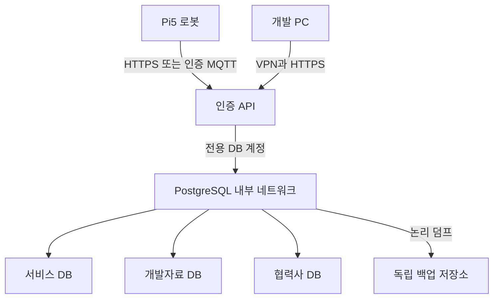

# NAS 개발 DB — 소규모 PostgreSQL 17

2026-10-06. **배포 준비 상태. NAS DB 설치·가동·접속·복원은 아직 완료되지 않았다.**

[실행 현황](../../docs/NAS_DB_STATUS_KO.md) · [Epic-12](https://lumira077.atlassian.net/browse/KR1-472)

기존 2026-10-05 준비 패키지를 소규모 합성 데이터 시험용으로 수정했다.
디스크 교체 전에는 재생성 가능한 최소 스키마 시험만 허용한다. 실제 고객·협력사 정보,
대화·영상 원문, 대량 적재, 부하 시험은 넣지 않는다. 디스크 교체/RAID 재구성 중 DB는 중지한다.
정식 개발 운영은 저장소 정상화와 독립 장치의 백업·복원 확인 후 전환한다.

| 항목 | 이번 설정 |
|---|---|
| 서버 | 공식 `postgres:17-bookworm`, 컨테이너 1개 |
| 자원 상한 | CPU 1코어 상당 quota, 메모리 1024MiB |
| DB 설정 | shared_buffers 128MB, max_connections 20 |
| 공유 메모리 | /dev/shm 128MiB |
| 재시작 | 자동 재시작 없음: 디스크 교체 전 제한 시험용 |
| 데이터 | 초기 1~5GB는 관리 목표이며 용량 제한이나 사전 할당이 아님 |
| 연결 | 내부 Docker network만 사용, NAS 호스트 포트 공개 없음 |
| 데이터 경로 | 패키지의 `data/`를 PostgreSQL 17의 `/var/lib/postgresql/data`에 마운트 |
| 비밀 | NAS 로컬 `secrets/db_admin_password`, 권한 600, 저장소에 커밋 금지 |

`17-bookworm`은 이동 태그다. 실제 다운로드 후 RepoDigest를 기록하고 운영 승인 때 검증한
`postgres@sha256:...`로 고정한다. 확인하지 않은 digest는 문서에 만들지 않는다.
PostgreSQL 18 이상은 데이터 경로 규칙이 다르므로 태그만 바꾸지 않는다.

| 논리 DB | 스키마 | NOLOGIN 권한 그룹 | 용도 |
|---|---|---|---|
| lumira_service_dev | app | lumira_service_runtime | 로봇 등록·설정·상태 등 서비스 개발 |
| lumira_engineering_dev | engineering | lumira_engineering_runtime | BOM·CAD/시험/소스 파일 참조 |
| lumira_partner_dev | partner | lumira_partner_runtime | 승인된 협력 자료 참조 |

DB별 PUBLIC CONNECT를 회수하고 자기 DB 권한 그룹에만 CONNECT를 부여한다.
그룹은 로그인할 수 없으며 테이블 읽기/쓰기 권한은 아직 없다. API 로그인 계정은 별도
비밀번호와 최소 테이블/시퀀스 권한을 설계한 뒤 만든다. 관리자 계정을 앱에 사용하지 않는다.
현재 SQL은 DB·그룹·스키마·migration 이력만 구현하며 실제 업무 테이블/API는 후속 작업이다.



이 그림은 목표 구조다. API/VPN/TLS/백업 저장소 연결은 아직 배포하지 않았다.
Pi5·PC에서 QuickConnect 주소의 5432로 직접 연결하지 않는다. DB 외부 포트포워딩을 만들지 않는다.
로컬 소켓의 trust는 컨테이너 관리자 작업에 한정된다. 네트워크 인증은 SCRAM이며,
SCRAM 자체가 전송 암호화는 아니므로 실제 데이터 사용 전에 TLS 또는 검증된 암호화 경로가 필요하다.

## 배포 순서

1. NAS 볼륨 1의 새 전용 공유 폴더 `lumira-db`에 패키지 업로드·압축 해제를 완료했다.
   실제 배포 경로는 `/volume1/lumira-db`다. 기존 웹사이트·컨테이너 경로를 덮어쓰지 않는다.
2. DSM Docker GUI의 태그 조회 실패가 확인됐다. `scripts/pull-image.sh`는 공식 이미지만
   내려받는 수동 작업 초안이다. **사용자 승인 후 2026-10-06 23:16:01~23:16:40 KST 1회 실행, 정상 종료(0).**
   자동 실행은 OFF 상태이며 `postgres:17-bookworm` 445MB가 Docker 이미지 목록에 표시됐다.
3. NAS의 지원되는 Compose 명령 존재를 확인한다. 없으면 별도 검토가 필요하며,
   임의의 설치 스크립트/패키지를 내려받지 않는다.
4. 관리자가 NAS 안에서 비밀을 생성·보관한다. 아래 명령은 **사용자가 직접 실행하는 예시**다.
   채팅·Jira·GitHub에 비밀번호를 붙여넣지 않는다. 생성 전 기존 파일 유무를 확인한다.

```sh
cd /volume1/lumira-db
umask 077
mkdir -p secrets
# 기존 비밀을 덮어쓰지 않는다. 생성은 관리자 본인이 수행한다.
(set -C; openssl rand -hex 32 > secrets/db_admin_password)
chmod 600 secrets/db_admin_password
```

5. 디스크 교체 전 승인된 소규모 합성 데이터 시험일 때만 다음 설정으로 준비 상태를 검사한다.
   `STORAGE_STATE`는 실제 상태에 대한 운영자 확인값이다. 스크립트가 RAID 상태를 자동 판별하지 않는다.
   충돌/읽기 전용 볼륨에서는 이 모드를 사용하지 않는다.

```sh
PREFLIGHT_MODE=synthetic SYNTHETIC_ONLY=yes STORAGE_STATE=degraded sh scripts/preflight.sh
# 비밀·경로·자원·네트워크 검토 및 배포 승인 후
PREFLIGHT_MODE=synthetic SYNTHETIC_ONLY=yes STORAGE_STATE=degraded sh scripts/deploy.sh
```

정식 개발 운영으로 전환할 때는 건강한 저장소와 독립 백업 복원을 실제 확인하고 기본 healthy
모드의 `STORAGE_HEALTH_VERIFIED=yes EXTERNAL_RESTORE_VERIFIED=yes`를 사용한다.
초기화 SQL은 빈 데이터 폴더 첫 시작에만 실행된다. 실패했다고 data를 삭제하지 않는다.
`deploy.sh`는 기존 컨테이너/비어 있지 않은 data 폴더를 발견하면 중단한다.

## 가동·권한·영속성 확인

```sh
docker exec lumira-postgres-dev pg_isready -U lumira_admin -d postgres
sh scripts/verify.sh
# 제한 시험에서 합성 migration 행의 재시작 후 유지 확인
docker restart lumira-postgres-dev
# 다시 healthy가 된 후
sh scripts/verify.sh
```

verify는 자원 제한·포트 비공개·3 DB·migration 버전·권한 그룹의 교차 DB CONNECT 차단을 검사한다.
실제 로그인 비밀번호 거부/성공, 앱 권한, API E2E, CPU 부하 실측은 별도 시험이다.

## 백업·복원

```sh
sh scripts/backup.sh
# 위 명령이 출력한 실제 backups/<시각-고유값>을 인자로 사용
sh scripts/restore-smoke.sh backups/<실제-완료-폴더>
```

완료 마커·DB별 custom-format dump·목차·SHA256·서버 버전을 생성한다. 실패한 .partial 파일을
완료 백업으로 간주하지 않는다. 복원은 새 임시 DB 3개에만 수행하고 성공한 임시 DB만 정리한다.
기존 DB를 덮어쓰거나 `--clean`으로 지우지 않는다. 실패하면 임시 DB를 남겨 조사한다.
현재 smoke 시험은 bootstrap migration만 검증한다. 업무 테이블이 추가되면 건수·외래키·업무값·권한
검증을 확장해야 한다. 덤프에 NOLOGIN/LOGIN 역할·ACL·비밀·외부 파일·WAL은 포함되지 않는다.
그룹은 코드로 재구성하고 로그인 비밀은 별도 관리한다. 클라우드 복원 후에는 API 계정 권한을 다시 적용한다.

같은 NAS의 backups는 장애에 독립적이지 않다. 암호화된 독립 장치/저장소로 복사하고 다른 서버에서
checksum 및 복원까지 확인해야 한다. 자동 백업 일정과 보관정책은 아직 등록하지 않았다.
이 논리 덤프는 PITR 또는 RPO 15분을 보장하지 않는다.

## 중지·교체·향후 이전

디스크 교체 전 `docker stop -t 60 lumira-postgres-dev` 후 종료를 확인한다.
RAID 재구성·정상화·외부 복원 검증 후 수동 시작한다. 재시작 정책 변경은 그때 별도 적용한다.
컨테이너/볼륨 삭제 명령과 `down -v`는 사용하지 않는다.

출시 시 서비스 DB는 관리형 클라우드 PostgreSQL로 옮긴다. NAS 개발자료 DB는 유지한다.
같은 메이저 버전으로 합성 데이터 덤프/복원 → 최소 권한/TLS → API E2E → 최종 쓰기 중지
→ 덤프/복원·정합성 확인 → API 접점 전환 순서다. 클라우드에서 새 쓰기가 생긴 후에는
오래된 NAS 데이터로 단순 복귀하지 않는다. 역이전/호환 앱 롤백을 별도 시험한다.

## 근거

- [공식 PostgreSQL 이미지](https://hub.docker.com/_/postgres)
- [PostgreSQL 17 SQL dump](https://www.postgresql.org/docs/17/backup-dump.html)
- [pg_restore](https://www.postgresql.org/docs/17/app-pgrestore.html)
- [Synology Docker 이미지 관리](https://kb.synology.com/ko-kr/DSM/help/Docker/Docker?version=6)
